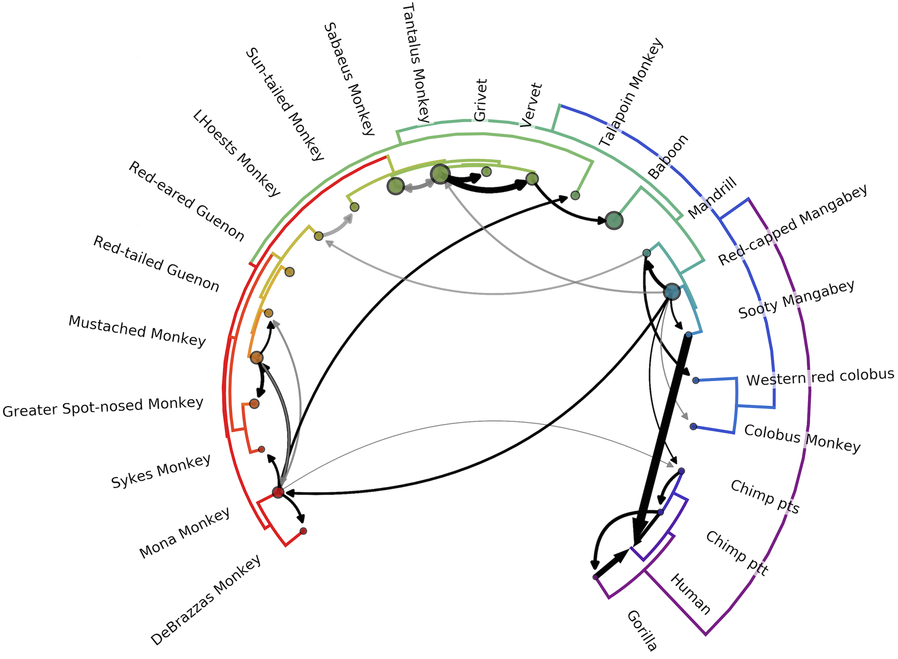
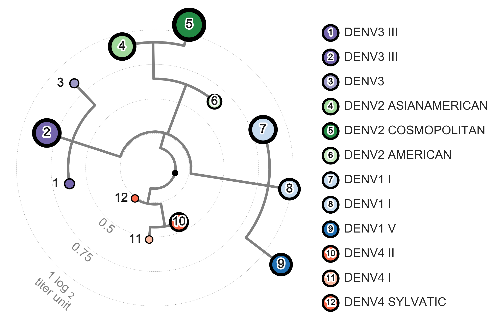

<b>Viral phylodynamics of host adaptation and antigenic evolution</b>

Sidney M. Bell 
Molecular and Cellular Biology 
Universtiy of Washington 
2018 

#### Abstract
RNA viruses evolve quickly, on a comparable timescale to viral spread.
Thus, each sampled case of an outbreak often carries a unique viral genomic signature.
By comparing these genomes, phylogenies can reconstruct the course of viral evolution.
These reconstructions are embedded with information about viral epidemiological patterns, which can be extracted via statistical models of population dynamics termed `phylodynamics'.
Here, I apply phylodynamic methods to two host/virus systems to investigate how viruses enter new populations, adapt to their hosts, and move through populations.
I apply discrete trait analysis to lentiviral genomes to characterize the natural history of cross-species transmission (CST) among primates.
I find that there have been at least 13 interlineage recombination events among lentiviruses, and identify 14 ancient CST events.
This reveals a far more extensive history of lentiviral CST than previously recognizd, emphasizing the importance of ongoing surveillance.
Next, I use a phylogeny-based model of antigenic change to quantify the extent and impact of antigenic evolution in dengue virus.
I identify at least 12 distinct antigenic phenotypes of dengue virus, suggesting unrecognized, ongoing antigenic evolution; this presents an important consideration for vaccine design.
I also find that antigenic novelty is a strong driver of dengue population turnover, providing context for epidemic preparedness efforts.
Together, these findings demonstrate the power of phylodynamics to broaden our understanding of how viruses evolve and move through populations.

#### See Also
This dissertation is a compilation of the work presented in two manuscripts. 
See the following links for the original manuscripts, datasets, analyses, etc.  

   

##### SIV cross-species transmission
[paper](https://bedford.io/papers/bell-siv-cst/) | [repository](https://github.com/blab/siv-cst) | [blog](https://bedford.io/blog/siv-transmission/)

    

   

##### Dengue antigenic evolution  
[paper](https://bedford.io/papers/bell-dengue-antigenic-dynamics/) | [repository](https://github.com/blab/dengue-antigenic-dynamics) | [blog](https://bedford.io/blog/dengue-antigenic-dynamics/)

     

&copy; <i><a href="https://twitter.com/sidneymbell">Sidney M. Bell</a> 2018  LaTeX <a href="https://github.com/sidneymbell/dissertation/tree/1505ee6b5fd50b3a1e0c9ada5f97a273f261a63d">template</a> adapted from <a href="https://staff.washington.edu/fox/tex/uwthesis.shtml">Jim Fox's</a></i>
